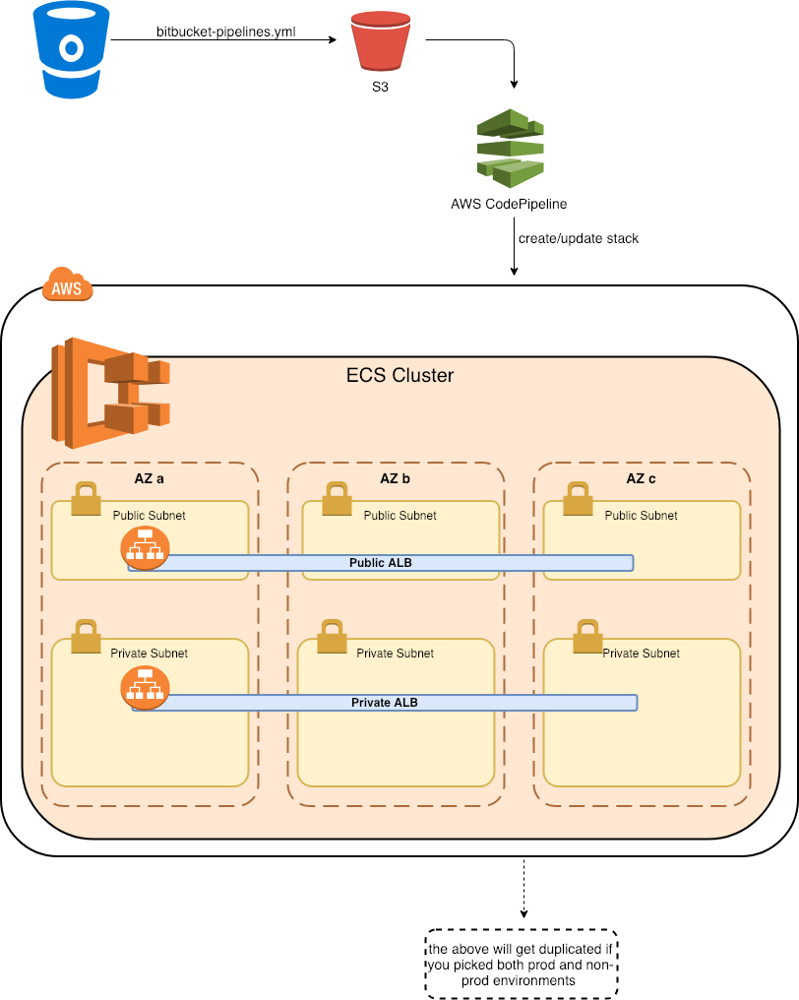

# Cookiecutter aws-ecs-cluster

Cookiecutter is a tool that creates projects from project templates. **This repository contains a project template to deploy an ECS cluster and ALB load balancers.** A project instantiated from this template can be used as hosting layer for Docker containers and other cookiecutter templates, such as [cookiecutter-aws-ecs-service](https://github.com/element7-io/cookiecutter-aws-ecs-service)

## Getting Started

### Prerequisites

In order to run this cookiecutter template, you need to install following:

#### \*nix an OS X

- python 3 (`check: python3 --version`)
- [Cookiecutter](https://github.com/audreyr/cookiecutter):
	```
	pip3 install cookiecutter
	```
- aws cli (`check: aws --version`)
- make tools (`make --version`)

#### Windows

On Windows, with [chocolatey](https://chocolatey.org) and [sudo](https://chocolatey.org/packages/sudo) installed 
```
sudo choco install python
sudo choco install awscli
pip install cookiecutter
```

#### Required AWS Resources

- **AWS CLI:** you should be logged in into the AWS CLI.
- **S3 bucket for the artefacts:** this bucket needs to be versioned.
- **S3 bucket for the Logs**
- **A GitHub repository**

### Configuration

**Create a cookiecutter config file containing the configuration for your service.** Cookiecutter will use the values from the config file as defaults when bootstrapping this template.

Find a cookiecutter config file example below:
```
default_context:
    # AWS settings
    aws_account_id: 123456789012
    aws_default_region: eu-west-1

    # Project settings
    project_name: ECS Blue Cluster
    project_short_description: A Cookiecutter generated ECS cluster example
    cloudformation_stack_prefix: ecs-blue

    # Source
    github_owner: github-owner
    github_repo: ecs-blue-cluster
    github_branch: master

    container_insights: enabled
    artifact_s3_bucket: artifacts-123456789012-eu-west-1-cfn
    log_bucket: logs-123456789012-eu-west-1-cfn
    nonprod_vpc_id: vpc-05fa69ba5418644d0
    nonprod_private_subnets: subnet-05d97978360bbf284,subnet-0402dd4a8b2f9f1c5,subnet-08dda5b9666a7d78a
    nonprod_public_subnets: subnet-0d0637c225e99b181,subnet-0afa0895deffd2da7,subnet-091532bd37e5fad92
    prod_vpc_id: ""
    prod_private_subnets: ""
    prod_public_subnets: ""
    deploy_public_alb: Y
    deploy_private_alb: Y
    ssl_certificate_arn: arn:aws:acm:eu-west-1:123456789012:certificate/9ff25a70-da6c-4173-b47d-8274acaf0074
    sns_alert_topic: arn:aws:sns:eu-west-1:123456789012:alerts
```

:warning: *Note: depending on the your preferences you should/could provide empty values for the prod or nonprod variables (don't omit these variables as this will break Cookiecutter, use empty strings as value instead). If empty values are specified the environment will be omitted.*

#### Configuration values explained

- **aws\_account\_id:**  The AWS account to deploy the ECS cluster in.
- **aws\_default\_region:** The AWS region to deploy the  ECS cluster in.
- **project\_name:** The name for the project. Cookiecutter will make a slug out of it by making it all lowercase and by replacing
whitespaces with dashes. Furthermore this slug will be used for naming resources and as you repository name.
- **project\_short\_description:** The project's description.
- **cloudformation\_stack\_prefix:** The prefix used to properly name the CloudFormation resources.
- **github\_owner:** GitHub owner.
- **github\_repo:** GitHub repository name.
- **github\_branch:** Git branch.
- **container\_insights:** enable/disable ECS container insights.
- **artifact\_s3\_bucket:** The S3 bucket to store the artefacts.
- **log\_bucket:** The S3 bucket to store the logs.
- **nonprod\_vpc\_id:** The VPC ID for non-production.
- **nonprod\_private\_subnets:** The private subnets of the non-production VPC.
- **nonprod\_public\_subnets:** The public subnets of the non-production VPC.
- **prod\_vpc\_id:** The VPC ID for production.
- **prod\_private\_subnets**: The private subnets of the production VPC.
- **prod\_public\_subnets:** The public subnets of the production VPC.
- **deploy\_public\_alb:** 'Y' to deploy the public Application Load Balancer
- **deploy\_private\_alb:** 'Y' to deploy the private Application Load Balancer
- **ssl\_certificate\_arn:** The SSL certifacte for the Application Load Balancer Lister
- **sns\_alert\_topic:** The SNS Topic for alerting

## Usage
1. Run cookiecutter in the directory where you usually checkout your git repositories. Cookiecutter will create a new sub-folder in this directory.

        $ cookiecutter --config-file .cookiecutter_example --no-input -f https://github.com/element7-io/cookiecutter-aws-ecs-cluster.git
1. Move to the newly created project

        $ cd yet-another-test-project

1. Enable git for this project:

        git init
        git add .
        git commit -m "Initial setup"

1. Create a new GitHub repository corresponding the values specified in the cookiecutter config file (github_owner, github_repo, github_branch).
1. Push your code to GitHub.
1. **To finish the setup read the `README.md` file in the newly created project.**


## Contributing
This cookiecutter template is **Community Driven**, so everybody is free to contribute. Read the [Contributors' Guide](CONTRIBUTING.md) for details on how-to contribute.

## Architecture
*Note: depending on the options you choose when executing the template certain components will not be deployed. The diagram below reflects the situation when* ***ALL*** *components are deployed.*



*This image can be edited with [draw.io](https://www.draw.io/). Find the source under /img/Cookiecutter_ecs.html.*
